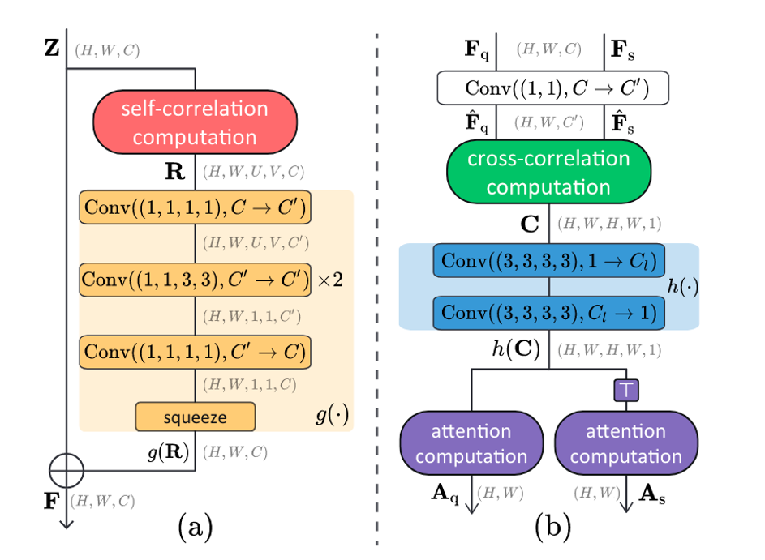

# Renet-pytorch

Pytorch implementation for paper [Renet (Relational embedding network)](https://arxiv.org/abs/2108.09666).

## Requirements

- Python==3.9.6
- torch==1.7.1
- torchvision==0.8.2
- GPU: NVIDIA GeForce RTX 3090 * 1

## Algorithm

- Self-correlation Representation:  a base feature map -> a self-correlation tensor

- Cross-correlation Attention: a self-correlation tensor -> co-attention

## Mini-Imagenet-S

According to the split in [ICLR(Meta-Learning with Fewer Tasks through Task Interpolation)](http://arxiv.org/abs/2106.02695), I split the raw mini-Imagenet dataset to reduce its training classes by specific sequence.

## Dermnet-S

According to the split in [ICLR(Meta-Learning with Fewer Tasks through Task Interpolation)](http://arxiv.org/abs/2106.02695), I split the raw Dermnet dataset to reduce its training classes by specific sequence.

## Remove validation

According to the training process in [ICLR(Meta-Learning with Fewer Tasks through Task Interpolation)](http://arxiv.org/abs/2106.02695), I remove the validation process during every epoch of training.

## Benchmark

|           |  Renet | Renet(gamma=2) | ProtoNet |  MAML |
|:---------:|:------:|:--------------:|:--------:|:-----:|
| ISIC 2018 | 78.033 |     64.245     |  78.180  | 61.42 |

|       | Mini-Imagenet-S(12) | Mini-Imagenet-S(25) | Mini-Imagenet-S(38) | Mini-Imagenet-S(51) | Mini-Imagenet(64) |
|:-----:|:-------------------:|:-------------------:|:-------------------:|:-------------------:|-------------------|
| Renet |        65.231       |        73.133       |        76.521       |        79.226       | 80.463            |
