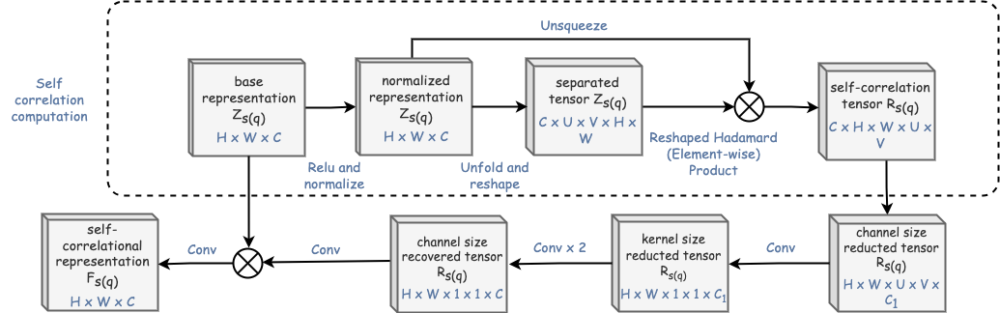

# Relational Embedded Few-Shot Network for GI image classification

## Overview
A deep learning model for classifying gastrointestinal diseases using endoscopic images. It utilizes Few-Shot Learning, data augmentation, relational embedding, and bi-level routing attention to accurately analyze medical images.


## Approach
- Few-Shot Learning (FSL)


- Data Augmentation via Task Interpolation


- Relational Embedding
  - *Self Correlation Representation (SCR)*  
  
  
  - *Cross Correlation Representation (CCR)*  
  

- Bi-Level Routing Attention Mechanism


## Installation
```bash
git clone https://github.com/ygritte723/gi_image_proj.git
cd gi_image_proj
pip install -r requirements.txt
```
## Usage
Detailed instructions for data preparation, training, and evaluation.

## Dataset
Tested on Hyper-Kvasir and Mini-ImageNet datasets.

## Results
Achieved notable performance metrics on the Kvasir dataset.

| Metric     | Value  |
|------------|--------|
| Accuracy   | 0.901  |
| Precision  | 0.845  |
| Recall     | 0.942  |
| F1 Score   | 0.891  |

